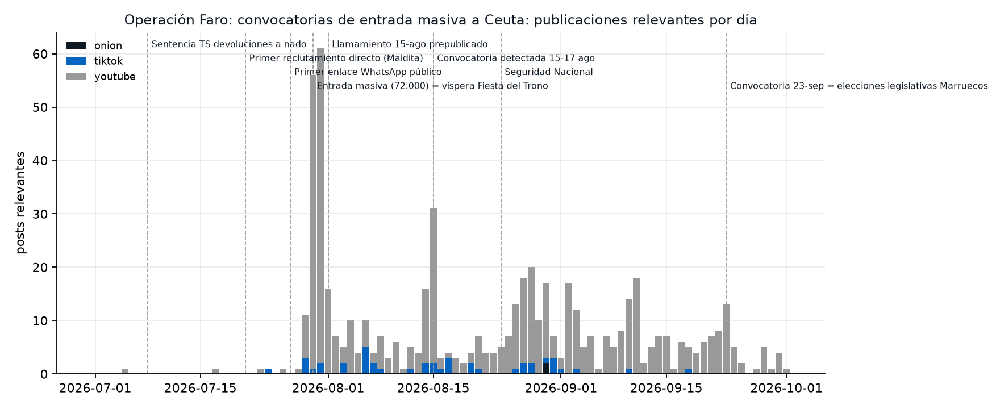

# Operación Faro: las convocatorias de entrada masiva a Ceuta (julio-septiembre de 2026)

*Informe de trabajo y cierre, versión 2. 1 de octubre de 2026. Don Z · me@donz.tech*

## Resumen

Entre el 28 de agosto y el 1 de octubre de 2026 analizamos con fuentes abiertas cómo se
convocaron en redes las entradas masivas a Ceuta: la del 30 de julio, que funcionó (unas 72.000
personas en 48 horas), y las del 15 de agosto y el 23 de septiembre, que fracasaron.

Las cinco conclusiones:

1. **La capa que convoca no es pública.** Los llamamientos se organizan en grupos de Facebook y
   de WhatsApp. En YouTube y TikTok solo encontramos cobertura y opinión: con 969 publicaciones
   captadas no aparece ninguna señal de coordinación (ni ráfagas, ni textos duplicados entre
   cuentas, ni vídeos resubidos).
2. **La convocatoria del 23-S existió y no se materializó.** Circuló por WhatsApp con el lema
   «الهجمة الكبرى» (la gran ofensiva). El refuerzo preventivo de los dos lados de la frontera y
   la detención en Marruecos de 10 difusores, repartidos por 8 ciudades, cerraron el ciclo.
3. **El léxico funcionó.** «الهجمة» estaba en nuestro léxico desde el 28 de agosto, como segundo
   término de un código que va rotando y que documentó Golden Owl. El 23-S volvió a usarse
   ampliado («الكبرى»).
4. **En abierto, el principal altavoz del 23-S fue el alarmismo en español.** Del 10 al 23 de
   septiembre, 16 vídeos en español de 12 canales anunciaron una "invasión" ese día (unas 255.000
   vistas). En árabe hubo 4 vídeos con unas 2.400 vistas, y presentaban la fecha como un complot
   argelino, no como un llamamiento.
5. **Que las fechas coincidan con hitos marroquíes sigue siendo una hipótesis.** El 30-J fue la
   víspera de la Fiesta del Trono y el 23-S, la jornada de elecciones legislativas. La
   coincidencia se repitió tal como anticipamos el 29 de agosto, pero ninguna fuente pública
   permite atribuir quién eligió las fechas.



*Publicaciones relevantes por día en el corpus captado (YouTube, TikTok, .onion). Picos: 61 el
31-jul, 31 el 15-ago y 13 el 23-sep.*

## 1. Qué se hizo

Para este trabajo construimos **faro**, la herramienta de este repositorio. Es una línea de
comandos de análisis OSINT pensada para reutilizarse en otras campañas:

- **Captación con cadena de custodia.** YouTube y TikTok (con yt-dlp), Telegram (Telethon, solo
  canales públicos), buscadores .onion a través de Tor y RDAP de dominios. Cada captura bruta se
  guarda una sola vez con su SHA-256. Al cierre, las 464 capturas verifican.
- **Seudonimización por defecto.** Toda cuenta que aparece en una salida lleva un seudónimo HMAC
  con clave local. El informe no expone a ningún usuario particular.
- **Detección de coordinación con dos señales como mínimo:** ráfagas de texto o de URL en
  ventanas cortas, textos casi duplicados (MinHash), vídeo resubido (pHash), cuentas creadas en
  lote y grafo de amplificación (PageRank y comunidades de Louvain).
- **Léxico multilingüe** en español, árabe estándar, dariya y arabizi (45 términos y 13 etiquetas), con los
  códigos que van rotando y normalización del árabe (tatweel y palabras fragmentadas a propósito).
- **Contexto de terceros** como dato estructurado: entidades, términos y relaciones documentadas
  por Golden Owl, Maldita, El Español y M. Madrigal, cada una con su fuente.

La campaña completa está en [`campaigns/ceuta-2026/`](../campaigns/ceuta-2026): léxico,
semillas, fechas clave, [línea temporal en ocho tramos](../campaigns/ceuta-2026/timeline.yml),
[entidades](../campaigns/ceuta-2026/entities.yml) y
[los 12 hallazgos con su nivel de confianza](../campaigns/ceuta-2026/findings.yml).

**Corpus final:** 549 vídeos de YouTube de 261 canales, 418 publicaciones de 3 cuentas de medios
en TikTok y 2 páginas .onion. Del 1 de julio al 1 de octubre de 2026.

## 2. Las tres convocatorias

| | 30 de julio | 15 de agosto | 23 de septiembre |
|---|---|---|---|
| Fecha marroquí | Víspera de la Fiesta del Trono | — | Elecciones legislativas |
| Dónde se convoca | Grupos de Facebook (hasta 190.000 miembros) y WhatsApp | Grupo de Facebook de 108.000 miembros, WhatsApp | WhatsApp, redes |
| Código | كرياج (kariaj, "el garaje") | — | الهجمة الكبرى |
| Siembra previa | Desde el 17-jul | Prepublicada el 1-ago | Detectada por VerificaRTVE el 15-ago |
| Respuesta | Ninguna preventiva visible | Despliegue marroquí amplificado por sus medios | Refuerzo en los dos lados, anunciado; 10 detenidos en Marruecos |
| Resultado | ~72.000 entradas, 141 muertos | ~30 interceptados | Normalidad |

## 3. Lo que anticipamos y lo que pasó

| Lo que dijimos el 29 de agosto | Lo que pasó |
|---|---|
| La capa de reclutamiento se ha ido de TikTok; hay que buscarla en Facebook y WhatsApp | Se confirmó: la convocatoria del 23-S circuló por WhatsApp |
| La capa de medios es cobertura, no movilización | Se mantiene con el corpus ampliado: ninguna señal de coordinación |
| Las fechas coinciden con hitos políticos marroquíes (hipótesis) | La convocatoria cayó en la jornada electoral; la autoría sigue sin establecerse |
| Hay que cruzar «23 شتنبر» con términos de Ceuta | El código «الهجمة» reapareció ampliado |
| La incitación cambia de objetivo por tramos y alimenta el 23-S desde los dos lados | En abierto, el alarmismo en español difundió la fecha cien veces más que el contenido en árabe |

## 4. Hallazgos

Resumen de [`findings.yml`](../campaigns/ceuta-2026/findings.yml). Allí está cada hallazgo
completo con la evidencia de la que sale.

| # | Hallazgo | Confianza |
|---:|---|---|
| 1 | Las cuentas de TikTok de reclutamiento han desaparecido | alta |
| 2 | La capa de medios no muestra coordinación: es cobertura, no movilización | alta |
| 3 | Las fechas convocadas coinciden con hitos políticos marroquíes | hipótesis |
| 4 | La incitación cambia de objetivo por tramos | media |
| 5 | En Tor, la única presencia relevante es la ultraderecha francesa | alta |
| 6 | La convocatoria del 23-S existió y no se materializó | alta |
| 7 | El código rotatorio volvió como «الهجمة الكبرى» | alta |
| 8 | Quien difundía estaba repartido por todo Marruecos, no en Fnideq | media |
| 9 | La hipótesis de las fechas sale reforzada, pero sigue sin probar | hipótesis |
| 10 | La capa decisiva volvió a quedar fuera de la captación | alta |
| 11 | En abierto, el 23-S lo difundió sobre todo el alarmismo en español | media |
| 12 | Ninguna señal de coordinación en el corpus público, tampoco en septiembre | alta |

## 5. Limitaciones

- **Sin acceso a la capa cerrada.** Facebook y WhatsApp no tienen acceso público programático, y
  la cuenta dedicada de Telegram no llegó a operar. Por eso este trabajo no puede responder quién
  convoca ni cómo se coordina. Es la limitación principal.
- **Muestra, no censo.** YouTube entra por 15 consultas en los dos idiomas y TikTok por 3 cuentas
  de medios (la búsqueda por hashtag no funciona con yt-dlp). Las cifras del hallazgo 11 son del
  corpus, no de toda la plataforma.
- **Léxico sin validar.** Ningún hablante nativo de dariya ha revisado el léxico.
- **Fuentes de una de las partes.** El dato de las detenciones viene del comunicado de la DGSN
  marroquí.
- **Hueco de captación del 16 al 30 de septiembre.** Lo recuperamos el 1 de octubre, después de los
  hechos. YouTube y TikTok conservan lo publicado; lo borrado en esos días no está.

## 6. Reproducir o reutilizar

```bash
uv venv .venv && uv pip install -e ".[dev]" && source .venv/bin/activate
faro collect all -c ceuta-2026     # capta solo lo nuevo; los datos van a ~/.local/share/faro/
faro analyze bursts -c ceuta-2026 --kind text
faro report -c ceuta-2026
```

Para otro tema, `faro campaign new <nombre>`: nada de esta campaña está cableado en el código.
Los datos brutos y el mapa de seudónimos no se publican.

## 7. Fuentes

- Golden Owl, *The Ceuta Mobilisation Network* (10-ago-2026)
- M. Madrigal, *Crisis migratoria de Ceuta-Fnideq, julio-agosto de 2026* (5-ago-2026)
- Maldita.es, *Antes del 30 de julio: así se organizó la entrada a Ceuta desde grupos de Facebook* (7-ago-2026)
- El Español, *WhatsApp coordinó y TikTok viralizó* (4-ago-2026)
- Medi24, «دعوات لـ"الهجمة الكبرى" نحو سبتة يوم 23 شتنبر» (22-sep-2026)
- EFE vía Infobae, *El Gobierno refuerza la frontera en Ceuta* (22-sep-2026) y *Normalidad en la frontera de Ceuta* (23-sep-2026)
- DGSN vía Chamalpress, detención de diez personas (23-sep-2026); EFE vía El Faro de Ceuta (23-sep-2026)
- Wikipedia, *Crisis migratoria de Ceuta de 2026*

Los enlaces completos están en [`campaigns/ceuta-2026/entities.yml`](../campaigns/ceuta-2026/entities.yml)
y en la sección de referencias de cada hallazgo.
